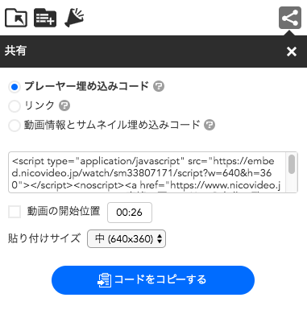
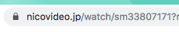

니코니코 동화 (ニコニコ動画)의 '공유' 기능을 이용하면, 영상 플레이어를 삽입할 수 있다. 하지만 제공되는 소스가 script 형식으로 되어 있어, 대부분의 웹 사이트나 플랫폼 서비스에서는 사실상 이용이 불가능하다.

더욱 황당한 것은, 저 스크립트의 기능을 보면 iframe을 생성하는 것 이외에는 어떠한 기능도 없다. 왜 니코니코 동화는 대체 script로 제공하는 것일까...

어찌 됐든, 본론으로 들어가서 iframe으로 간단하게 영상을 삽입해보자.

# 간단한 소스

```
<iframe width="640" height="360" src="https://embed.nicovideo.jp/watch/sm33807171" frameborder="0" allow="autoplay; encrypted-media" allowfullscreen></iframe>
```

> src 안에 있는 링크에, **sm33807171** 부분을 변경하면 된다.

## 영상의 아이디?



니코니코 동화의 영상 시청 페이지에서 주소창을 보면, 아이디를 알 수 있다. '/watch/' 뒤에 있는 **'sm01234567' 이 아이디**인 것.

# 적용 예시

<iframe src="https://embed.nicovideo.jp/watch/sm33807171" width="640" height="360" frameborder="0" allowfullscreen=""></iframe>

최근 내가 자주 듣는 곡인 '폐허의 나라의 엘리스'를 글에 삽입해 본 모습. 실제로 재생도 문제 없이 이루어진다.
