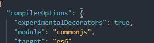
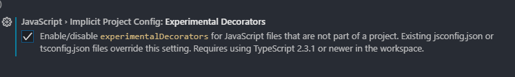

Visual Studio Code가 내보내는 오류로, TypeScript에서 ES7의 Decorator를 추가적인 설정을 하지 않고 사용할 경우 발생하는 오류입니다.

## 해결 방법

tsconfig.json에 `experimentalDecorators` 항목을 `true`로 변경해주면 해결됩니다.

## 해결이 안되는 경우

계속 Visual Studio Code가 동일한 오류 또는 경고를 내보낸다면, Visual Studio Code에 설정을 변경해주면 됩니다.

해당 옵션을 체크하면 오류가 해결됩니다.
