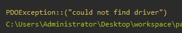
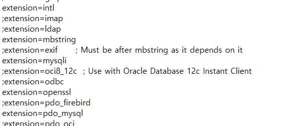
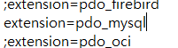

가끔씩 개발을 윈도우 환경에서 급하게 꾸려서 할 때가 있는데, 매우 간편하게 여러 가지 개발 환경을 갖춰주는 Chocolatey 패키지 관리자를 애용하고는 한다.

PHP 개발을 로컬에서 하게 되었을 때, MySQL 연결 시 문제가 발생.

## 오류 내용

Driver를 찾을 수 없다는 오류.

## 해결 방법

아무래도 Chocolatey PHP 패키지에서는 mysqli 확장이 기본적으로 활성화되어 있지 않은 것 같다.

Dynamic Extensions 부분에서, `extension=mysqli` 앞에 `;` 가 있을 경우 `;` 를 삭제하고 저장하면 해결된다.

### 그래도 안된다면?

동일한 Dynamic Extensions 부분에 `pdo_mysql` 도 `;` 을 풀어보자.
