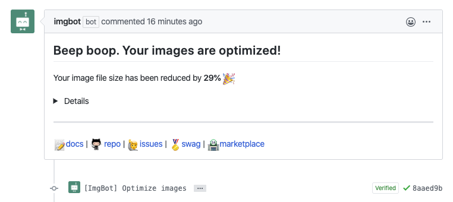
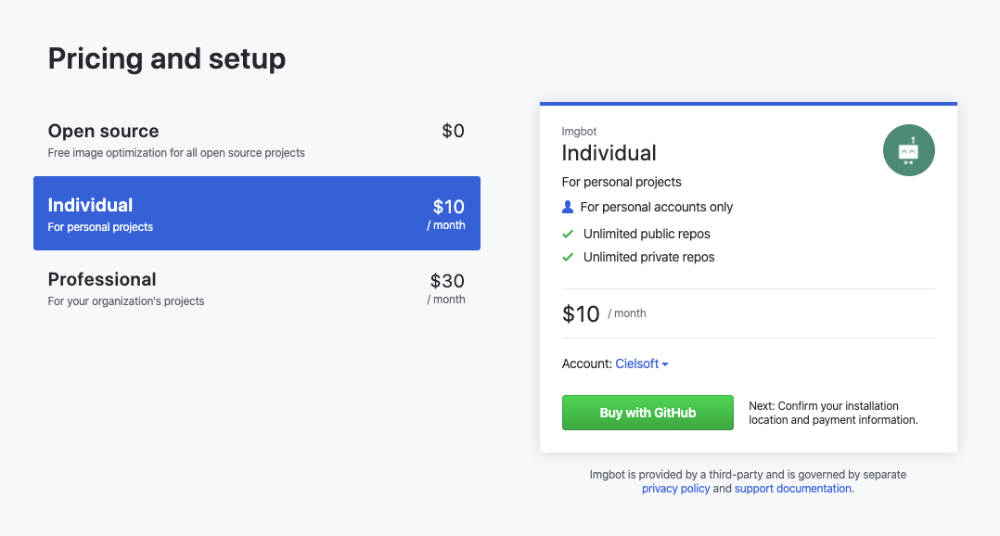
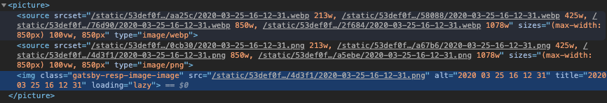

정적 페이지 블로그는 보통의 경우, Git을 이용해서 컨텐츠를 관리하는 경우가 많다.

하지만 백-엔드가 없는 정적 페이지의 특성상 자동으로 이미지를 최적화 할 수 있는 방법이 별로 없을 것이다.

## Imgbot

[Imgbot](https://imgbot.net/)은 Git에 푸시를 하면, 이미지를 최적화 한 후에 PR 작업을 자동으로 해준다. 사실상 이 봇은 정적 페이지를 위해 나온 것이 아닐까 하는 생각이다.

GitHub 연동만 지원하며, 가격은 공개(Public) 레포지토리에는 무료, 공개가 아니더라도 개인은 월 10달러로 이용 가능하다.

> 다만 알아야 할 것이, Imgbot은 이미지를 <u>**최적화**</u> 하는 것이지 <u>**리사이징**</u> 해주지는 않는다. 엄청난 효과는 기대해서는 안된다.

## (gatsby 전용) `gatsby-image`를 이용한 사이즈 리사이징

다른 정적 페이지 생성기는 모르겠지만, Gatsby의 경우 플러그인을 이용하여 빌드 시 이미지를 리사이징 시킬 수 있다.

[gatsby-image 플러그인](https://www.gatsbyjs.org/packages/gatsby-image/)을 참고하길 바란다.

기기 크기 별로 이미지가 나눠져 있고, webp로 변환되어 있는 모습이다. 이렇게 사용한다면 모바일에서도 큰 데이터 절약을 기대해볼 수 있다.

## 마치며

나는 위에 적어놓은 두 방법을 모두 적용시켜놨다. `gatsby-image`가 빌드 시 optimizing을 해주는 것 같기는 하지만, 레포지토리 크기도 아끼고 좋을 것 같아서 적용했다.
