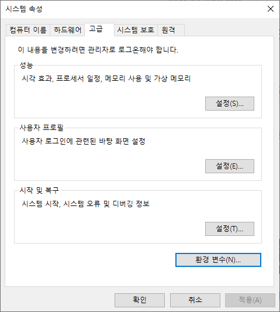
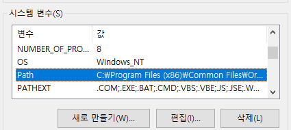

최근 노트북 개발이 증가하면서, 자연스럽게 Windows 환경에서 개발하는 경우가 많아졌다. 따라서 기존에는 macOS에서 처리하던 작업도 모두 Windows에서 병행하게 되었다.

근데 이상하게 예전에도 그랬는데 yarn global 명령어로 설치한 바이너리들이라던가, 명령어들이 먹지를 않는다.

## 해결 방법

🔼 `yarn global bin` 명령어로 Yarn 의 bin 폴더를 확인하고, 복사해준다.

🔼 시스템 속성에서 환경 변수를 눌러 환경 변수를 관리하는 창에 들어가주도록 하자. (Windows 10 검색 창에, 고급 시스템 설정 보기을 검색하면 나온다.

🔼 시스템 변수에 있는 Path 를 찾아서, 편집을 눌러준다.

🔼 새로 만들기를 통하여, Yarn 의 bin 폴더를 등록해주면 된다.

## 기타

Github Issue 를 통해 해결법을 얻을 수 있었다.
https://github.com/yarnpkg/yarn/issues/3431#issuecomment-303399450
