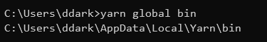

최근 노트북 개발이 증가하면서, 자연스럽게 Windows 환경에서 개발하는 경우가 많아졌다. 따라서 기존에는 macOS에서 처리하던 작업도 모두 Windows에서 병행하게 되었다.

근데 이상하게 예전에도 그랬는데 yarn global 명령어로 설치한 바이너리들이라던가, 명령어들이 먹지를 않는다.

## 해결 방법

🔼 `yarn global bin` 명령어로 Yarn 의 bin 폴더를 확인하고, 복사해준다.
