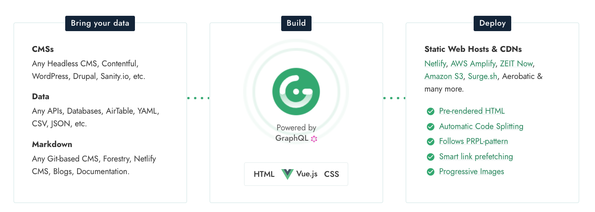
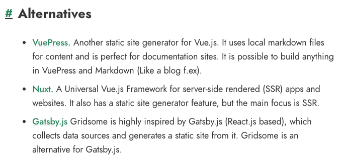
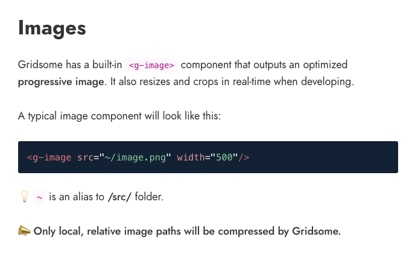
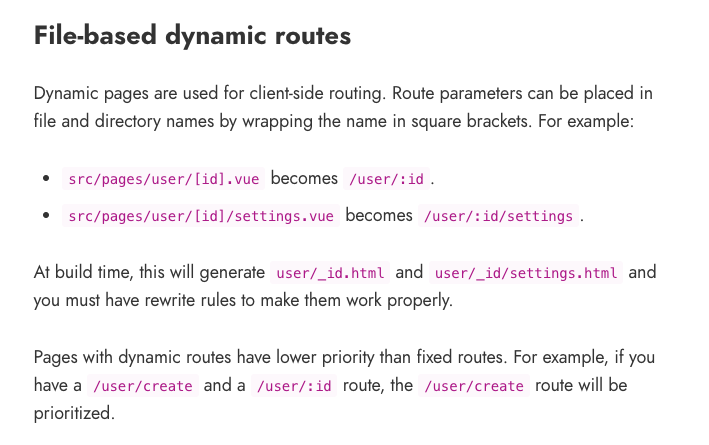
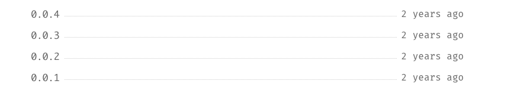
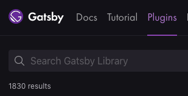
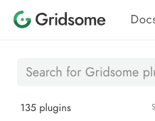
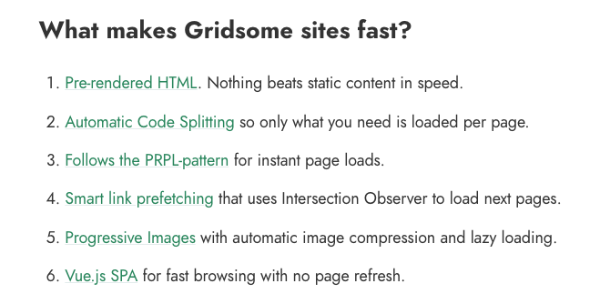

최근 우연히 알게된, [Gridsome](https://gridsome.org/)이라는 정적 사이트 생성기가 있다. 근데 이거 그냥 Gatsby의 Vue.js 버전이라고 봐도 무방할 정도로 처리 구조가 비슷하다.

GraphQL을 이용하여 데이터를 처리하고, Pre-render 된 HTML을 내보내준다.

# Gatsby와의 관계

[공식 문서](https://gridsome.org/docs/#alternatives)에서도 밝히고 있을 정도로, Gatsby에서 영감을 받아서 시작된 프로젝트인 것 같다.

# 장점

## 이미지 자동 최적화

자체 이미지 로더를 제공하고 있고, 이 로더를 사용하면 이미지 최적화부터 LazyLoad까지 기본으로 지원된다.
플러그인이 아닌 공식 코어에서 제공하는 것은 꽤 괜찮다고 생각한다.

다만 이건 Gatsby 에서도 플러그인 한 개 정도라면 간편하게 처리할 수 있는 방식이라, 큰 장점까지는 아니다.

## Nuxt.js 방식의 파일 라우팅

[Nuxt.js](https://ko.nuxtjs.org/) 처럼 파일 라우팅을 제공한다. 간단하게 사용자들이 페이지를 만들 수 있는 점은 좋은 듯.

# 단점

## 적은 커뮤니티, 그리고 지원

사용자도 그렇고, 커뮤니티 개발자도 얼마 없는 듯 하다. 공식 영문 문서에서 `Contribute...` 라고 적어논 라이브러리는 없던 것 같은데...

npm에 최초로 업로드 된 일시가 2년 전이다.

실제로 사용하면서 문제가 벌어지는 일은 없겠지만, 중요한 프로덕션에 사용한다면 고려해봐야하는 문제 중 하나일 수 있다.

## 적은 플러그인

 

(작성일 기준)

눈물이 앞을 가리는 플러그인 숫자다. 필요한 것들은 있지만 역시 더 나아가보면 필요한 기능을 플러그인을 이용해서 구현하지 못할 수 있다.

하지만 필요한 플러그인에 대해서는 직접 찾아보고 판단하길 바란다.

# 총평

**정적 페이지** (특히 블로그)를 만들고 싶은 사람이고 GraphQL을 숙지하고 있다면 강추지만, 그 이외의 용도로는 차라리 [Nuxt.js](https://ko.nuxtjs.org/)를 권장한다.

장점으로 내세우고 있는 것들 6개 중 3개를 Nuxt.js도 지원하고, 그 외에도 GraphQL를 제외한다면 내세울만한 특장점을 찾지 못했다. 오히려 GraphQL을 모르는 사용자라면 개발을 느려지게 하지 않을까.

그래도 블로그나 기술 문서를 목표로 한다면, [Gridsome Starters](https://gridsome.org/starters/)를 적절히 이용한다면 개발 시간을 단축할 수 있지 않을까.

나라면, 내가 React.js에 익숙하다면 Gatsby를. Vue.js에 익숙하다면 Gridsome을 사용할 것 같다.
