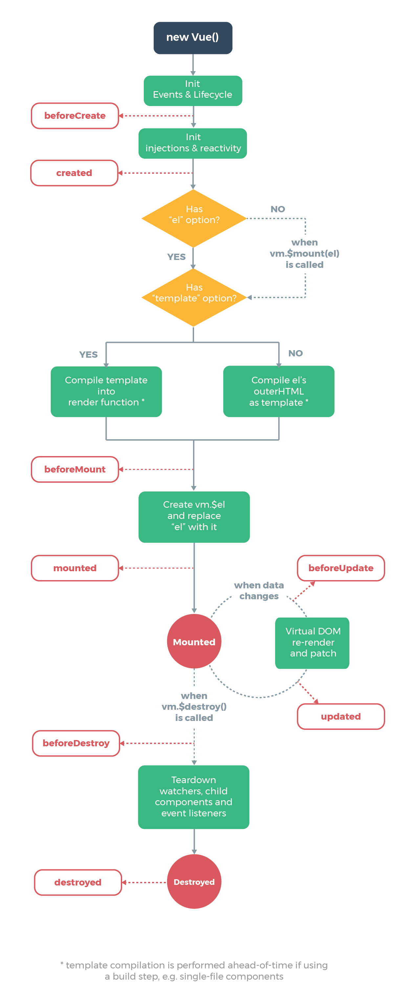
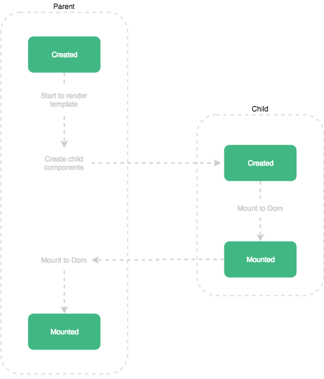

# 들어가며

최근 나는 Vue.js로 토이 프로젝트를 진행하고 있다. 혼자 쓸 프로젝트라서 코드 작성이라던가 최적화를 크게 신경쓰며 진행하고 있지 않았는데, 레이아웃 컴포넌트가 모두 렌더링 되고 나서 실행해야 하는 로직이 생겨 라이프사이클에 대해 알아보기 시작하였다. 

# lifecycle (생명주기) 알아보기

Vue.js 버전 2의 라이프사이클에서 중요한 부분이라고 생각되는 것은 Create, Mount, Update, Destroy이라 이런 부분들을 상세하게 적어보겠다.

> 이미지의 출처는 [Vue.js 문서](https://kr.vuejs.org/v2/guide/instance.html#%EB%9D%BC%EC%9D%B4%ED%94%84%EC%82%AC%EC%9D%B4%ED%81%B4-%EB%8B%A4%EC%9D%B4%EC%96%B4%EA%B7%B8%EB%9E%A8)이다.

라이프사이클 다이어그램을 보면, 매우 간단하게 어느 로직을 어느 단계에 적용해주어야 할지 파악할 수 있다.

## Create

- `Vue()` 인스턴스의 라이프사이클 중 맨 처음에 실행
- 컴포넌트들이 DOM에 추가되기 전이기 때문에, DOM에 접근하거나 `vm.$el`을 사용할 수 없음
- SSR 적용 시 서버 사이드에서도 실행 가능한 단계

### beforeCreate

- 제일 먼저 실행되는 훅입
- 데이터와 이벤트들(`vm.$on`, `vm.$once`, `vm.$off` 등)이 설정되지 않아, 접근할 수 없음

### created

- `beforeCreate`와는 다르게 injection 이후에 이루어지므로 데이터나 이벤트들을 사용할 수 있음.
- 템플릿과 가상 DOM이 마운트 및 렌더링되지 않은 시점.

## Mount

- 렌더링 직전의 컴포넌트에 접근할 수 있음.
- 이 단계부터는 서버 사이드에서 호출되지 않기에, 접근할 수 없음.

### beforeMount

- 함수들이 컴파일 직후, 렌더링 직전에 실행.

### mounted

- DOM이 메모리에 생성되고 렌더링 된 이후에 실행됨.
- `vm.$el`이 생성된 시점이라, 요소에 접근 가능
- 추가적인 팁
  - `vm.$nextTick`으로, 전체 렌더링 상태를 보장할 수 있음.
  - child가 있을 경우, **child 컴포넌트의 mounted를 기다린 후에, 실행됨** (해당 관련 된 부분은 하단에 추가 서술하겠음.)

## Update

- 컴포넌트가 재 렌더링시에 실행.
- 흐름 상 당연하겠지만, 서버 사이드에선 실행되지 않음.

### beforeUpdated

- 컴포넌트에서 사용되는 속성이 변하여, 업데이트 사이클이 시작되었을 때 실행. 정확히는, DOM이 재 렌더링되기 전에 실행.

### updated

- 재 렌더링 이후에 실행. DOM과 관련된 로직 처리가 가능.
- 모든 child 컴포넌트들의 렌더링 상태를 보장하지 않음.
  - `mounted`와 마찬가지로, `vm.$nextTick`를 사용 시에 전체 렌더링 상태를 보장할 수 있음.

## Destroy

- 이것도 역시 당연하겠지만, 서버 사이드에서는 실행되지 않음.

### beforeDestroy

- Vue 인스턴스가 제거되기 전에 실행. 컴포넌트는 원래 모습과 원래 기능들을 가지고 있음.
- 이벤트 리스너나 subscription 제거에 사용하면 좋음.

### destroyed

- Vue 인스턴스 제거 후에 실행. 모든 인스턴스와 디렉티브가 바인딩 해제되고, 모든 이벤트들이 제거됨.
  - 하위 Vue 인스턴스도 제거됨.

# 부모 컴포넌트와 자식 컴포넌트의 `mounted` 흐름

만약 부모 컴포넌트에서 자식 컴포넌트를 호출하였을 때, 둘 다 `mounted`가 존재한다고 가정하자.

그럼 다이어그램의 플로우대로, 자식 컴포넌트의 `mounted`가 먼저 실행된 이후에 부모 컴포넌트의 `mounted`가 실행된다.

# reference

- https://vuejs.org/v2/guide/instance.html#Instance-Lifecycle-Hooks>
- https://medium.com/witinweb/vue-js-%EB%9D%BC%EC%9D%B4%ED%94%84%EC%82%AC%EC%9D%B4%ED%81%B4-%EC%9D%B4%ED%95%B4%ED%95%98%EA%B8%B0-7780cdd97dd4
